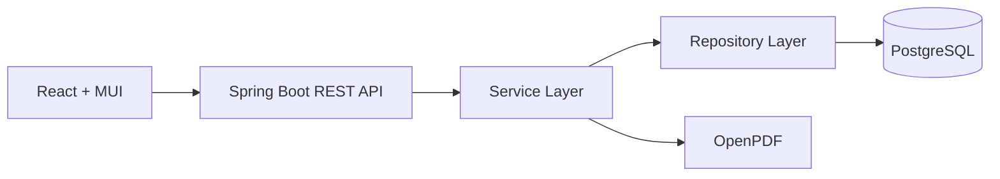
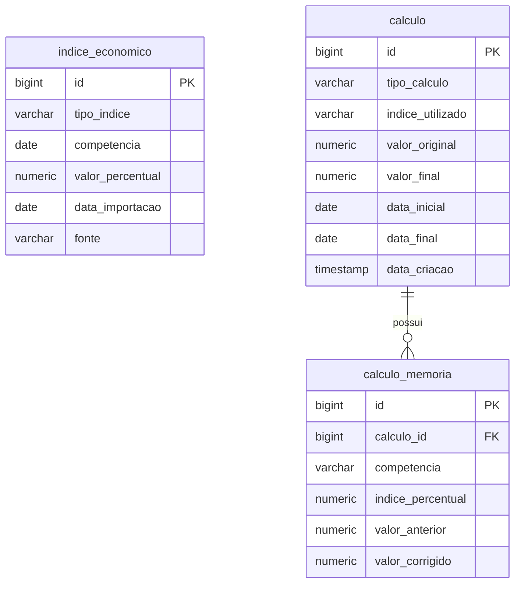

# JurisCalc

Aplicação web para atualização monetária e cálculo reverso com índices oficiais, voltada ao uso jurídico.

## Integrantes

- Charles Muller
- Fernando Rodrigues
- Jonathan Chiari

## Visão Geral

O sistema possui duas partes:

- Backend em Spring Boot com API REST, persistência em PostgreSQL e geração de PDF.
- Frontend em React com interface para cadastro, consulta, cálculo e importação de índices.

Os índices econômicos podem ser importados manualmente pela API ou pela tela de índices. A importação automática na inicialização fica desativada por padrão.

## Tecnologias

- Backend: Java 21, Spring Boot, Spring Data JPA, Spring Security, Hibernate, Flyway, PostgreSQL, OpenPDF, Jsoup
- Frontend: React, React Router, Axios, Material UI, Vite, TypeScript

## Estrutura

- `backend/`: API REST e regras de cálculo
- `frontend/`: interface web responsiva

## Arquitetura



## Diagrama ER



## Instalação

1. Suba o PostgreSQL.
2. Configure as variáveis `SPRING_DATASOURCE_URL`, `SPRING_DATASOURCE_USERNAME` e `SPRING_DATASOURCE_PASSWORD` se necessário.
3. Execute o backend em `backend/`.
4. Execute o frontend em `frontend/`.

Se preferir, use o script do Windows em `backend/start-postgres.ps1` para montar as variáveis de ambiente e subir o backend em um único comando.

## Backend

```bash
cd backend
mvn spring-boot:run
```

Se estiver no Windows:

```powershell
Set-Location backend
mvn spring-boot:run
```

Automação no Windows (configura credenciais e sobe em um comando):

```powershell
Set-Location backend
.\start-postgres.ps1 -DbHost localhost -DbPort 5432 -DbName calculos_judiciais -DbUser postgres -AskPassword
```

Se a porta 8080 já estiver ocupada por outra instância do backend, use:

```powershell
Set-Location backend
.\start-postgres.ps1 -DbPassword "sua_senha" -StopExisting8080
```

Opcionalmente, você pode informar a senha direto no comando:

```powershell
Set-Location backend
.\start-postgres.ps1 -DbPassword "sua_senha"
```

Observação: este repositório não inclui Maven Wrapper (`mvnw`/`mvnw.cmd`), então o comando acima usa o Maven instalado no sistema.

### Importação de índices

Os índices são carregados manualmente pelos endpoints abaixo:

- `POST /api/indices/importar-selic`
- `POST /api/indices/importar-ipca`
- `POST /api/indices/importar-igpm`

A SELIC é importada da API pública do Banco Central. IPCA e IGP-M são importados do site Dados de Mercado.

Na tela de índices, os botões de importação executam os mesmos endpoints.

## Frontend

```bash
cd frontend
npm install
npm run dev
```

Para gerar a versão de produção do frontend:

```bash
cd frontend
npm run build
```

Para visualizar o build gerado localmente:

```bash
cd frontend
npm run preview
```

## API

### Cálculos

- `POST /api/calculos/atualizacao`
- `POST /api/calculos/reverso`
- `GET /api/calculos`
- `GET /api/calculos/{id}`
- `DELETE /api/calculos/{id}`

### Índices

- `GET /api/indices`
- `POST /api/indices`
- `PUT /api/indices/{id}`
- `DELETE /api/indices/{id}`

- `POST /api/indices/importar-selic`
- `POST /api/indices/importar-ipca`
- `POST /api/indices/importar-igpm`

Use os botões de importação na tela de índices para carregar SELIC, IPCA e IGP-M manualmente.

### Relatórios

- `GET /api/relatorios/{id}/pdf`
- `POST /api/relatorios/consolidado/pdf`

O relatório consolidado recebe uma lista de IDs de cálculos e gera um PDF com o resumo geral e os detalhes de cada conta.

### Sistema

- A tela `Configurações do sistema` permite alternar entre modo claro e modo escuro.
- A preferência visual é salva no navegador.

## Exemplo de uso

```json
{
  "valorInicial": 1000,
  "dataInicial": "2024-01-01",
  "dataFinal": "2024-03-31",
  "indiceUtilizado": "SELIC"
}
```

Resposta resumida:

```json
{
  "valorFinal": 1015.98,
  "memoria": [
    { "competencia": "2024-01", "indicePercentual": 0.52, "valorAnterior": 1000.0, "valorCorrigido": 1005.2 }
  ]
}
```

## Observações

- As migrações Flyway ficam em `backend/src/main/resources/db/migration`.
- O cálculo usa capitalização mês a mês.
- A importação automática de índices na inicialização está desativada por padrão.
- A estrutura de segurança atual libera os endpoints para uso local e futuro ajuste de autenticação.

## Execução em Produção

Para distribuir o sistema em outro computador, a abordagem mais simples é executar o frontend e o backend como serviços web na mesma máquina ou em um servidor com PostgreSQL disponível.

Uma implantação típica inclui:

1. Build do frontend com `npm run build`.
2. Build do backend com `mvn clean package`.
3. Deploy do JAR em um servidor com Java 21.
4. Configuração do PostgreSQL e das variáveis de ambiente do datasource.

O repositório também contém `docker-compose.yml`, mas ele não está alinhado com o banco usado pelo backend nesta versão.

## Video

- https://youtu.be/PsPQS38g2H8
